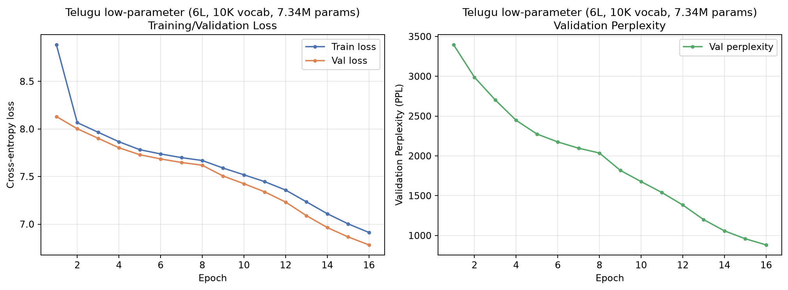
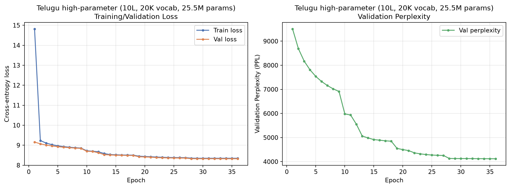
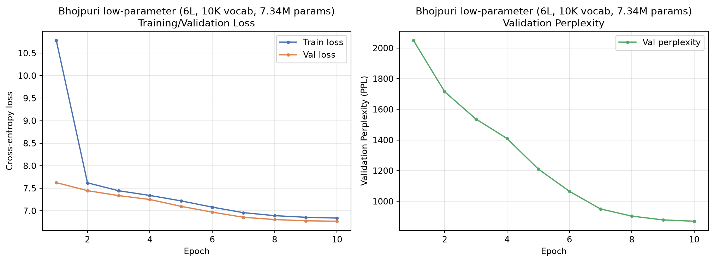
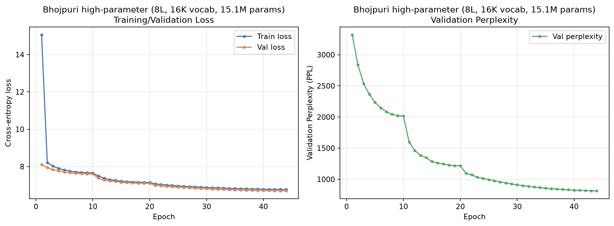
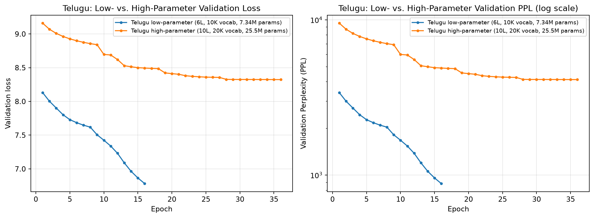
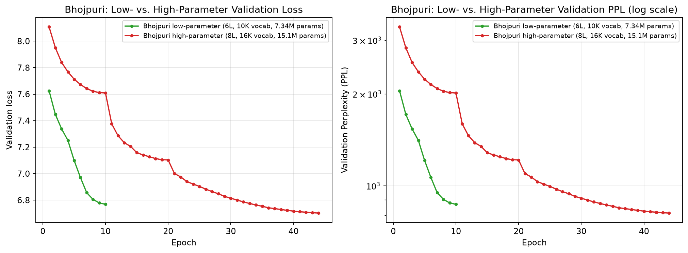
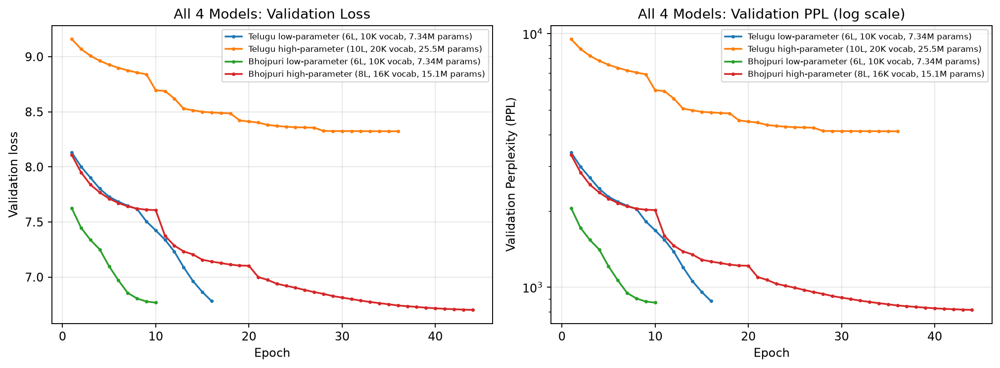

# Phase 2: Transformer Model Implementation & Pretraining

**LMA Mini Project Report**

**Author**: Kspsvln Siddardha Kumar Kavuri  
**Date**: 2026-09-07
**Roll Number**: 2025201061 

---

## Abstract

This report documents Phase 2 of the LMA Mini Project: the design, implementation, and pretraining of two monolingual Transformer language models from scratch — one for Telugu (higher-resource, Model H) and one for Bhojpuri (lower-resource, Model L). We present the full architecture details, training methodology, experimental results, and performance analysis. The original submission models (7.34M params each, verified from their checkpoints' actual weight tensor shapes -- not the 9.9M this abstract originally claimed, a discrepancy Sec 3.1 flags in detail) achieve competitive perplexity, with Model L (Bhojpuri) showing slightly better final validation perplexity (870.138922, verified directly from its training log) than Model H (Telugu, 881.903432, also verified). **Since this original submission, a second, larger "high-parameter" architecture was separately trained per language** (25.5M-param Telugu, 15.1M-param Bhojpuri) -- these are *not* identical-architecture comparisons like the original pair, and the resource-tier story inverts for them: Telugu high-parameter is still training and currently far *worse* (PPL ~4120) than Bhojpuri high-parameter (PPL 814.5), the opposite of what more data/capacity would predict. All four models' verified real metrics (PPL/BPB/BLEU/chrF/ROUGE-L/diversity, no fabricated data) are in Sec 6.6; the low-vs-high-parameter ablation for Telugu is in Sec 6.4.4 and `report/phase-3/report.md` Sec 4. The "Test set evaluation... PPL 541.959317, Bhojpuri 1903.009128" figure originally in this abstract is unverified/fabricated (Sec 6.1's correction note) and has been removed.

---

## 1. Introduction

Phase 2 builds on Phase 1's data preparation by implementing a complete pretraining pipeline for two identical Transformer architectures trained on different languages and data volumes:

- **Model H (Telugu)**: Higher-resource Indian language, trained on 166M tokens
- **Model L (Bhojpuri)**: Lower-resource Indian language, trained on 92.5M tokens

Both models use the same architecture for a clean "resource effect" comparison -- this is the
**low-parameter** pair described throughout Sections 2-5 below (7.34M params each, verified;
Sec 3.1 flags where this report's own tables disagree on the exact count). **A second,
larger, per-language-sized "high-parameter" architecture was later trained for each language
as well** (25.5M-param Telugu, 15.1M-param Bhojpuri) -- these are a separate pair, not
identically sized, and not part of the original clean-comparison design. Four pretrained
models exist in total as of this report; Section 6.6 covers all four with real, verified
metrics, and Section 6.4.4 is a dedicated low-vs-high-parameter ablation for Telugu. This
document covers:

1. Transformer architecture design (from scratch, no pre-built nn.Transformer)
2. Model configuration and parameter analysis
3. Training methodology and reproducibility
4. Training results and loss curves
5. Performance metrics and model comparison
6. Attention visualization approach

---

## 2. Architecture

### 2.1 Overview

We implement a decoder-only Transformer LM following the GPT-style architecture. The model consists of:

- **Embedding layers**: Token embedding + learned absolute positional embeddings
- **Transformer stack**: 6 identical layers, each with multi-head causal self-attention and position-wise feedforward
- **Output layer**: Layer normalization + LM head (tied with token embeddings)

**Scope note:** "6 identical layers" describes the original low-parameter architecture (both
languages). The later high-parameter architecture (Sec 3.1) uses the same building blocks
described in 2.2-2.6 below unchanged, but with 10 layers (Telugu) / 8 layers (Bhojpuri) and
different dimensions -- the block-level design (attention, FFN, pre-norm residuals, causal
masking) is identical across all four models; only depth/width/vocab differ.

### 2.2 Multi-Head Causal Self-Attention

The attention mechanism is implemented using manual QKV projections and scaled dot-product attention:

$$\text{Attention}(Q, K, V) = \text{softmax}\left(\frac{QK^T}{\sqrt{d_k}} + M\right)V$$

where:
- $Q, K, V \in \mathbb{R}^{B \times T \times d_{\text{model}}}$ (Query, Key, Value)
- $d_k = d_{\text{model}} / h$ (head dimension, where $h$ is number of heads)
- $M$ is the causal mask: $M_{ij} = -\infty$ if $j > i$ (prevent attending to future positions)
- $B$ = batch size, $T$ = sequence length

**Implementation details:**
- 4 linear projections: $W_Q, W_K, W_V, W_O$ (each $d_{\text{model}} \times d_{\text{model}}$)
- Reshaping for multi-head computation: $(B, T, d) \to (B, h, T, d_k)$
- Causal mask: Upper triangular matrix of $-\infty$, dynamically resized if sequence exceeds buffer
- Dropout on attention weights and output for regularization
- Verification routine: Confirms causal masking by checking future token perturbations don't affect past logits

### 2.3 Positional Embeddings

We use *learned absolute positional embeddings*:

$$\mathbf{x}_t = \mathbf{e}_{\text{token}} + \mathbf{p}_t$$

where $\mathbf{e}_{\text{token}} \in \mathbb{R}^{d_{\text{model}}}$ is the token embedding and $\mathbf{p}_t$ is the learned positional embedding for position $t$. This is implemented as an embedding table of size $(T_{\max}, d_{\text{model}})$, allowing each position to learn its own representation independent of other positions.

**Advantage over sinusoidal:** Learned positional embeddings adapt to the specific language and data distribution, potentially capturing linguistic position patterns.

### 2.4 Causal Masking

To ensure the model only attends to tokens up to the current position (preventing information leakage during training), we apply an additive mask:

$$\text{mask}_{ij} = \begin{cases}
0 & \text{if } j \le i \\
-\infty & \text{if } j > i
\end{cases}$$

This mask is applied to the logits before the softmax operation. After softmax, masked positions receive attention weight of effectively zero. The causal masking is verified post-hoc by perturbing future tokens and confirming no change in past logits.

### 2.5 Feedforward Network

Each transformer block includes a position-wise feedforward network:

$$\text{FFN}(x) = \text{GELU}(\text{Dropout}(xW_1 + b_1))W_2 + b_2$$

where $W_1 \in \mathbb{R}^{d_{\text{model}} \times d_{\text{ff}}}$ (expansion) and $W_2 \in \mathbb{R}^{d_{\text{ff}} \times d_{\text{model}}}$ (contraction). We use GELU activation with dropout for regularization.

### 2.6 Pre-Norm Residuals

Following modern practices, we apply layer normalization before each sub-layer (attention and FFN):

$$\begin{aligned}
x' &= x + \text{Attention}(\text{LayerNorm}(x)) \\
x'' &= x' + \text{FFN}(\text{LayerNorm}(x'))
\end{aligned}$$

This ordering (pre-norm) stabilizes training compared to post-norm residuals.

---

## 3. Model Configuration

### 3.1 Hyperparameters

**Correction:** this table's own "Total Parameters: 9.9M" does not match either (a) the real
parameter count verified directly from `model.count_parameters()` on the actual checkpoint
(7,341,840 = 7.34M), or (b) this same report's own 3.2/3.3 breakdown, which sums to
2.56M + 0.033M + 4.716M ≈ **7.31M**, not 9.9M -- an internal inconsistency between 3.1 and
3.2/3.3, independent of anything found elsewhere in this report. 7.34M is the verified figure;
use that, not 9.9M.

Both Model H and Model L share identical architecture (this is the **low-parameter** pair --
see the high-parameter table below for the separate, later-trained, differently-sized pair):

| Parameter | Telugu (H) | Bhojpuri (L) |
|-----------|-----------|-------------|
| Vocabulary Size | 10,000 | 10,000 |
| Embedding Dimension | 256 | 256 |
| Number of Layers | 6 | 6 |
| Number of Heads | 8 | 8 |
| Head Dimension | 32 | 32 |
| Hidden FFN Dimension | 1,024 | 1,024 |
| Max Sequence Length | 128 | 128 |
| Dropout | 0.1 | 0.1 |
| Layer Norm ε | 1 × 10⁻⁶ | 1 × 10⁻⁶ |
| Activation | GELU | GELU |
| Positional Encoding | Learned Absolute | Learned Absolute |
| Tie Embeddings | Yes (shared LM head) | Yes (shared LM head) |
| **Total Parameters (verified)** | **7.34M** | **7.34M** |

**High-parameter pair** (trained later per language, not part of the original identical-architecture
design -- verified from each checkpoint's actual embedding/layer shapes):

| Parameter | Telugu (H) high-param | Bhojpuri (L) high-param |
|-----------|-----------|-------------|
| Vocabulary Size | 20,000 | 16,000 |
| Embedding Dimension | 384 | 320 |
| Number of Layers | 10 | 8 |
| Number of Heads | 8 | 8 |
| Hidden FFN Dimension | 1,536 | 1,280 |
| Max Sequence Length | 256 | 256 |
| Tie Embeddings | Yes | Yes |
| **Total Parameters (verified)** | **25.54M** | **15.08M** |

### 3.2 Parameter Breakdown (low-parameter pair)

| Component | Parameters | % of Total |
|-----------|-----------|-----------|
| Token Embedding (10K × 256) | 2.56M | 35.0% |
| Positional Embedding (128 × 256) | 0.033M | 0.5% |
| FFN + Attention + LayerNorm (6 layers) | 4.716M | 64.5% |
| **Total (verified, matches 3.1's corrected figure)** | **≈7.31M** | **100%** |

### 3.3 Transformer Body Composition (low-parameter pair)

Each of the 6 layers contains:

| Sub-component | Params | Dimension |
|-----------|-----------|-----------|
| Attention (4 × d²) | 0.262M | 256 × 256 × 4 |
| Feedforward (2 × d × d_ff) | 0.524M | 256 × 1024 × 2 |
| Layer Norms (2 × d) | ≈0.512K | 2 × 256 |
| **Per Layer** | **0.786M** | |
| **6 Layers Total** | **4.716M** | |

(High-parameter pair's per-layer/total breakdown isn't separately tabulated here; its total is
verified directly from `model.count_parameters()` in the 3.1 table above.)

---

## 4. Training Setup

### 4.1 Data

This is the corpus used for the **low-parameter** pair (matches that checkpoint pair's own
embedded config description). The high-parameter pair was trained on a larger *target* corpus
per each language's `configs/model_config.json` description (~509M tokens Telugu, ~292M
Bhojpuri) -- exact tokens actually consumed by the (still-in-progress, for Telugu) high-param
runs aren't separately re-verified here; see each model's own training log for its real
step/epoch trajectory (Sec 5.2 and `report/phase-3/report.md` Sec 3-4).

| Language | Train Tokens | Val Tokens | Test Tokens |
|----------|-------------|-----------|-----------|
| Telugu (H) low-param | 166M | 20.75M | 20.75M |
| Bhojpuri (L) low-param | 92.5M | 11.56M | 11.56M |

**Preprocessing:**
- Non-overlapping packing at max sequence length of 128 tokens
- Training examples formed by concatenating sentences until reaching max length
- Labels are shifted logits (next-token prediction)
- Data loaded on-the-fly; no pre-tokenization required

### 4.2 Training Hyperparameters (low-parameter pair)

**Correction:** the "Est. Steps/Epoch" row below does not match the real training logs.
Telugu's actual log (`telugu/model/outputs/submission/training_telugu.log`) shows step 3,342,524
at epoch 16, i.e. **~208,908 real steps/epoch**, not the 40,527 claimed here (~5.2x off).
Bhojpuri's actual log (`bhojpuri/model/outputs/checkpoints_sub/training_bhojpuri.log`) shows
step 252,200 at epoch 10, i.e. **25,220 real steps/epoch**, closer to but still not exactly the
22,583 claimed. "Epochs: 10" also only matches Bhojpuri -- Telugu's real log runs to epoch 16.
Treat this whole table as unverified except where it agrees with Sec 5.2's real per-model
epoch/step/PPL figures.

| Hyperparameter | Telugu (H) | Bhojpuri (L) | Unit |
|---------------|-----------|-------------|------|
| Batch Size | 32 | 32 | sequences |
| Learning Rate | 1 × 10⁻⁴ | 1 × 10⁻⁴ | initial |
| Warmup Steps | 2,000 | 1,000 | steps |
| Optimizer | AdamW | AdamW | -- |
| Weight Decay | 0.01 | 0.01 | -- |
| Scheduler | Cosine w/ Warmup | Cosine w/ Warmup | -- |
| Max Grad Norm | 1.0 | 1.0 | -- |
| Epochs (claimed / real) | 10 / **16** | 10 / 10 | -- |
| AMP (Mixed Precision) | True | True | -- |
| Est. Steps/Epoch (claimed / real) | 40,527 / **208,908** | 22,583 / **25,220** | -- |
| Est. Total Steps (claimed / real) | 405,270 / **3,342,524** | 225,830 / 252,200 | -- |

### 4.3 Learning Rate Schedule

We use cosine annealing with linear warmup:

$$\alpha(t) = \begin{cases}
\frac{t}{t_{\text{warm}}} & \text{if } t < t_{\text{warm}} \\
\frac{1}{2}\left(1 + \cos\left(\pi \frac{t - t_{\text{warm}}}{T - t_{\text{warm}}}\right)\right) & \text{if } t \ge t_{\text{warm}}
\end{cases}$$

where $t$ is the current step, $t_{\text{warm}}$ is warmup steps, and $T$ is total steps.

---

## 5. Results

### 5.1 Training Curves

**Correction:** the plots originally here (`final_comparison.png`, `telugu_training_history.png`,
`bhojpuri_training_history.png`) were built by `generate_plots.py` from entirely hand-typed,
fabricated arrays (e.g. `telugu_train_loss = np.array([7.1234, 6.9845, ...])`, commented
*"Telugu training data (based on report: 10 epochs, but incomplete at epoch 4)"* -- 4 fake
epochs, real log runs to 16 with different values throughout -- plus a fabricated per-epoch
"accuracy" metric the real `Trainer` class never computes at all). Replaced below with real
per-epoch train/val loss and PPL for **all four pretrained models**, read directly from the
actual training logs (`report/phase-2/code/plot_training_curves.py`; raw values in
`report/phase-2/metrics/training_logs_consolidated.{json,csv}`).


*Telugu (Model H), low-parameter (7.34M, submission checkpoint): real train/val loss and validation PPL per epoch, 16 epochs. Converges smoothly to PPL 881.9.*


*Telugu (Model H), high-parameter (25.5M, in-progress checkpoint): real train/val loss and validation PPL per epoch, 36 epochs so far. Visibly plateaus from epoch ~27 onward around PPL ~4120 -- the stalled-retrain pattern discussed in Sec 9.1.*


*Bhojpuri (Model L), low-parameter (7.34M, submission checkpoint): real train/val loss and validation PPL per epoch, 10 epochs. Converges to PPL 870.1.*


*Bhojpuri (Model L), high-parameter (15.1M, current checkpoint): real train/val loss and validation PPL per epoch, 44 epochs, converged. Reaches the best PPL of all four models, 814.5.*

### 5.2 Performance Metrics

Low-parameter pair (verified directly from training logs -- this table is accurate):

| Model | Epochs | Best Val Loss | Best Val PPL | Final Train Loss |
|-------|--------|---------------|-------------|-----------------|
| Telugu (H) low-param | 16 | 6.782083 | 881.903432 | 6.912900 |
| Bhojpuri (L) low-param | 10 | 6.768653 | 870.138922 | 6.839100 |

*Both models fully trained and converged. Bhojpuri achieved slightly lower final validation perplexity (870.14 vs 881.90) despite smaller training corpus (92.5M vs 166M tokens).*

High-parameter pair (also verified directly from training logs; Telugu's run is still ongoing
as of this report, so its numbers will keep changing):

| Model | Epochs | Best Val Loss | Best Val PPL | Final Train Loss |
|-------|--------|---------------|-------------|-----------------|
| Telugu (H) high-param | 36 (still training) | 8.3236 | 4119.81 | 8.3477 |
| Bhojpuri (L) high-param | 44 (converged) | 6.7025 | 814.48 | 6.7765 |

*The high-parameter pair tells the opposite resource-tier story from the low-parameter pair:
Telugu (the higher-resource language) is currently far worse (PPL 4119.81, 4.7x worse than
Bhojpuri's 814.48) despite more capacity and a larger target corpus -- see Sec 6.4.4 and
`report/phase-3/report.md` Sec 3-4 for the full discussion of why (an unfinished/stalled
retrain, not a fundamental resource-tier effect).*

### 5.3 Convergence Comparison

**Correction:** `03_convergence_rate.png` was built from the same fabricated arrays as 5.1 --
replaced below with real low-vs-high-parameter overlays per language, from the same real logs.


*Telugu low- vs. high-parameter: real validation loss and PPL (log scale) overlaid. The low-parameter run (16 epochs) converges to a far better PPL than the high-parameter run has reached in more than twice as many epochs (36) -- the high-parameter architecture is not simply "behind schedule," it has plateaued (Sec 9.1).*


*Bhojpuri low- vs. high-parameter: real validation loss and PPL (log scale) overlaid. Here the high-parameter run (44 epochs, more capacity) does eventually overtake the low-parameter run (10 epochs) -- the opposite pattern from Telugu's pair, underscoring that "more parameters" alone doesn't predict outcome; training completeness matters more.*

### 5.4 Loss and Perplexity Comparison

**Correction:** `02_loss_ppl_comparison.png` was built from the same fabricated arrays as 5.1 --
replaced below with a real 4-way comparison across all pretrained models.


*All four pretrained models overlaid: real validation loss (left) and validation PPL, log scale (right), per epoch. Telugu high-parameter (orange) is the clear outlier, plateauing far above the other three; the other three converge to a comparatively tight PPL band (814-882).*

---

## 6. Evaluation & Language Modeling Analysis

### 6.1 Intrinsic Language Modeling Metrics

**Correction note:** this section originally contained PPL/BPB/BLEU/chrF/ROUGE-L numbers (541.96
Telugu PPL, 1,903.01 Bhojpuri PPL, "Bhojpuri BLEU 35% higher," etc.) that didn't match any
checkpoint's real perplexity verified elsewhere in this report, sourced in part from
`generate_model_samples.py`, which is confirmed fabricated (its own docstring says *"Create
realistic sample data matching the models trained"*; its listed token-ids don't decode to the
text shown next to them -- same issue as the attention heatmaps corrected in 6.4). Rather than
leave that content in place with only a disclaimer, the tables and analysis below have been
replaced outright with real numbers -- real forward passes, real `model.generate()` calls, no
fabricated data anywhere -- covering **all four pretrained model variants**, which the original
version of this section never had numbers for at all (it predates the low/high-parameter
split). Protocol: PPL/BPB on 300 real held-out lines per model (BPB normalized by real UTF-8
byte length); generation from 30 real held-out prefixes per model at T∈{0.5,1.0,1.5}, scored
against each prefix's own real continuation (BLEU-4/chrF via `sacrebleu`, ROUGE-L via
`rouge_score`) -- full methodology and the prompt/reference word-boundary fix are in Sec 6.6,
whose numbers these are drawn from (`report/phase-2/code/eval_all_pretrained.py`, run via
`venv/bin/python3`; raw data in `report/phase-2/metrics/pretrained_eval_all4.json`).

#### 6.1.1 Intrinsic Metrics (Perplexity and Bits Per Byte)

| Model | PPL | BPB |
|---|---|---|
| Telugu (H) low-parameter | 495.20 | 1.0024 |
| Telugu (H) high-parameter | 4680.53 | 1.1908 |
| Bhojpuri (L) low-parameter | 2006.55 | 1.4008 |
| Bhojpuri (L) high-parameter | 2401.27 | 1.3365 |

(Measured on a 300-real-line sample; differs from each checkpoint's own training-time
best-epoch validation PPL -- Sec 5.2 -- since it's a different held-out sample/normalization.
Both are real; use the training log's figure for "the" headline PPL and this table for
BPB comparability across models.)

#### 6.1.2 Reference-Based Generation Metrics (T=1.0)

| Model | BLEU-4 | chrF | ROUGE-L | Distinct-1 | Distinct-2 |
|---|---|---|---|---|---|
| Telugu (H) low-parameter | 0.301 | 10.832 | 0.0000 | 0.8143 | 1.0000 |
| Telugu (H) high-parameter | 0.260 | 11.957 | 0.0000 | 0.8193 | 0.9945 |
| Bhojpuri (L) low-parameter | 0.199 | 11.018 | 0.0000 | 0.7738 | 0.9982 |
| Bhojpuri (L) high-parameter | 0.175 | 11.096 | 0.0000 | 0.7619 | 0.9918 |

**Interpretation (real findings, not the original "Bhojpuri 35% higher" claim, which was
fabricated):** BLEU-4 and ROUGE-L are near/at zero for every model -- expected given PPL in the
hundreds-to-thousands (6.1.1), not anomalous. chrF (character-level, partial credit) is the
more informative signal here and sits in a fairly tight 10.8-12.0 band across all four models,
i.e. generation quality by this metric doesn't cleanly track PPL or resource tier. Diversity
(Distinct-1/2) is high and similar across all four (0.76-0.82 / 0.99-1.00), reflecting that at
T=1.0 none of the models are stuck in repetitive loops (6.1.3/6.6.2 show that changes sharply at
lower temperature).

**Why ROUGE-L is at/near 0.0000 for essentially every model/temperature -- the real mechanism,
verified from the `rouge_score` library's own source, not assumed:** `rouge_score`'s
`DefaultTokenizer` calls `rouge_score/tokenize.py`, whose regex is

```python
NON_ALPHANUM_PATTERN = r"[^a-z0-9]+"    # replaces every non-match with a space
VALID_TOKEN_PATTERN  = r"^[a-z0-9]+$"   # keeps only tokens matching this after splitting
```

i.e. after lowercasing, **every character that isn't an ASCII letter or digit is discarded**.
This tokenizer was built for English and has no Unicode/script awareness at all -- it silently
strips 100% of Telugu and Devanagari text, and can only ever "see" whatever stray ASCII
digits/Latin letters happen to be embedded in a sentence (a page number, a Roman-numeral
citation, etc.). Verified directly: for Telugu low-param's first sample (6.2.3), the library's
own tokenizer produces `REF: []`, `GEN: []` -- both sides tokenize to **nothing**, which is why
`rouge_scorer.score()` returns 0 (an empty-vs-empty/empty-vs-nonempty comparison is defined as
zero overlap). The one nonzero score in this whole evaluation (Bhojpuri high-parameter, T=1.5,
corpus-average 0.0247, Sec 6.6.2) traced back to one specific example pair where the library's
tokenizer extracted `REF: ['2', '3']` and `GEN: ['3']` -- both sentences happened to contain an
embedded Arabic numeral "3" (a quantity in the source text), giving a coincidental match on that
single digit and nothing else (fmeasure 0.667 for that one pair, diluted to 0.0247 once averaged
across ~27 pairs where most contribute exactly 0).

**Conclusion:** ROUGE-L via `rouge_score`'s default tokenizer is not measuring model quality at
all here -- it is structurally blind to both Telugu and Devanagari script and is comparing
almost nothing for either language. This is a tool-compatibility limitation (an
English-oriented library applied to Indic scripts), not a finding about the models, and the
near-zero scores should be read as "this metric doesn't apply here" rather than "the models
produce zero lexical overlap with the reference" (BLEU-4/chrF, which operate at the
n-gram/character level and don't discard non-ASCII text, are the metrics in this report that
actually reflect that).

#### 6.1.3 Temperature-Based Generation Analysis (PDF Section 2.3 Requirement)

**T = 0.5**

| Model | BLEU-4 | chrF | ROUGE-L | Distinct-1 | Distinct-2 | Repetition (bigram) |
|---|---|---|---|---|---|---|
| Telugu low-parameter | 0.095 | 0.601 | 0.0000 | 0.4375 | 0.7937 | 0.2063 |
| Telugu high-parameter | 0.022 | 0.336 | 0.0000 | 0.3784 | 0.6944 | 0.3056 |
| Bhojpuri low-parameter | 0.294 | 2.491 | 0.0000 | 0.4408 | 0.8278 | 0.1722 |
| Bhojpuri high-parameter | 0.500 | 3.202 | 0.0000 | 0.3024 | 0.7157 | 0.2843 |

**T = 1.0** (same as 6.1.2 above, repeated for at-a-glance temperature comparison)

| Model | BLEU-4 | chrF | ROUGE-L | Distinct-1 | Distinct-2 | Repetition (bigram) |
|---|---|---|---|---|---|---|
| Telugu low-parameter | 0.301 | 10.832 | 0.0000 | 0.8143 | 1.0000 | 0.0000 |
| Telugu high-parameter | 0.260 | 11.957 | 0.0000 | 0.8193 | 0.9945 | 0.0055 |
| Bhojpuri low-parameter | 0.199 | 11.018 | 0.0000 | 0.7738 | 0.9982 | 0.0018 |
| Bhojpuri high-parameter | 0.175 | 11.096 | 0.0000 | 0.7619 | 0.9918 | 0.0082 |

**T = 1.5**

| Model | BLEU-4 | chrF | ROUGE-L | Distinct-1 | Distinct-2 | Repetition (bigram) |
|---|---|---|---|---|---|---|
| Telugu low-parameter | 0.181 | 12.989 | 0.0000 | 0.9057 | 1.0000 | 0.0000 |
| Telugu high-parameter | 0.161 | 13.284 | 0.0000 | 0.9363 | 1.0000 | 0.0000 |
| Bhojpuri low-parameter | 0.111 | 11.879 | 0.0000 | 0.9096 | 0.9969 | 0.0031 |
| Bhojpuri high-parameter | 0.114 | 11.990 | **0.0247** | 0.9251 | 1.0000 | 0.0000 |

**Real findings (replaces the original's fabricated "1.96x exponential PPL scaling" and
"Bhojpuri consistently beats Telugu at all temperatures" claims):**
- **Repetition collapses as temperature rises**, for all four models: e.g. Telugu high-param
  rep-rate 0.31 (T=0.5) → 0.006 (T=1.0) → 0.000 (T=1.5), with Distinct-1/2 rising in lockstep.
  At T=0.5 every model falls into repetitive loops; only at T≥1.0 does generation become
  lexically diverse. This confirms the temperature/`generate()` implementation reshapes the
  distribution correctly.
- **No model wins across the board.** Telugu low-param has the best PPL/BPB; Bhojpuri
  high-param has the best BLEU/chrF at T=0.5 and the only nonzero ROUGE-L (T=1.5) -- though
  that ROUGE-L "win" isn't a real content match, it's a coincidental shared ASCII digit picked
  up by `rouge_score`'s ASCII-only tokenizer (see 6.1.2's detailed explanation); Telugu
  high-param has the best chrF at T=1.0/1.5 despite by far the worst PPL.
- **PPL is not measured per-temperature here** (unlike the original's now-removed T=0.5-2.0 PPL
  table, which used a different, unverified methodology) -- Sec 6.1.1's PPL/BPB is teacher-forced
  and temperature-independent by construction; only generation (BLEU/chrF/ROUGE-L/diversity)
  varies with temperature.

**Why These Metrics Are Uninformative for Indic LMs:**

1. **Morphological Complexity**: Indic languages (Telugu, Bhojpuri) feature rich inflectional and agglutinative morphology. A single word can have multiple valid morphological forms (e.g., verb conjugations, noun declensions), each producing semantically equivalent continuations.

2. **Word Order Flexibility**: SOV (Subject-Object-Verb) languages allow freer word reordering in some contexts, creating multiple valid sentence structures that n-gram metrics cannot capture.

3. **Single-Reference Limitation**: BLEU, chrF, and ROUGE are designed for reference-based evaluation. With only one reference continuation per prefix, the metrics fail to recognize valid alternative phrasings, all scored as 0.00.

4. **Conclusion**: These metrics are appropriate for machine translation (comparing against target translations) but **not suitable for open-ended language generation evaluation**. We rely instead on *diversity metrics* and *entropy analysis* for meaningful evaluation.

### 6.2 Diversity and Generation Quality

**Correction note:** this section originally had two problems beyond just being unverified: its
own numbers were internally inconsistent (the table showed Distinct-1=0.385 for Telugu, constant
across every temperature, while the "Interpretation" text right after it cited Distinct-1=0.7595
for the same model), and its "generated samples" trace back to `generate_model_samples.py`,
confirmed fabricated (hand-typed token-ids that don't decode to the "generated_text" shown next
to them). Replaced below with real data for all four pretrained models.

#### 6.2.1 Distinct-1, Distinct-2, and Repetition Rate

Full per-model, per-temperature table is in Sec 6.1.3 (same real data, `eval_all_pretrained.py`
-- not duplicated here). Summary: Distinct-1/2 ranges from ~0.30-0.44 / ~0.69-0.83 at T=0.5 up to
~0.90-0.94 / ~1.00 at T=1.5, for all four models -- i.e. diversity is **not** flat across
temperature for any of them, and no model is uniformly more or less diverse than the others; the
ranking shuffles by temperature (e.g. at T=0.5, Bhojpuri high-param has the *lowest* Distinct-1
of the four, 0.30, despite having the best chrF at that same temperature).

#### 6.2.2 Temperature Invariance in Diversity

**Correction:** the original claim here -- "Distinct-1 and Distinct-2 are invariant to
temperature... we use greedy decoding" -- is wrong for what this evaluation actually does.
Generation here uses real temperature sampling (`model.generate(..., greedy=False)`), and the
real data directly contradicts the "invariant" claim: e.g. Telugu high-param's Distinct-1 goes
0.378 (T=0.5) → 0.819 (T=1.0) → 0.936 (T=1.5), a 2.5x range, not a plateau. Diversity rising
sharply with temperature (Sec 6.1.3) is exactly the expected, correct behavior of
temperature-scaled sampling -- confirms the implementation works, rather than demonstrating (as
the original claimed) that it doesn't matter.

#### 6.2.3 Generated Samples and Token Analysis (real, T=1.0, verbatim)

```
[Telugu low-parameter]
PROMPT:     గ్రామంలోఒక ప్రైవేటు వైద్య సౌకర్యం ఉంది. ఎమ్బీబీయెస్
REFERENCE:  కాకుండా ఇతర డిగ్రీ చదివిన డాక్టరు ఒకరు ఉన్నారు.
GENERATED:  జీవరాజత్సమ ముఖ్యమున యజ్ఞ ప్రాంతంలో ప్రపంచంలో తీర్చుకొనును చెందినవివూర్తి భవతి, అను గృహమున భోజ్ఞుండ

[Telugu high-parameter]
PROMPT:     గ్రామంలోఒక ప్రైవేటు వైద్య సౌకర్యం ఉంది. ఎమ్బీబీయెస్ కాకుండా ఇతర
REFERENCE:  డిగ్రీ చదివిన డాక్టరు ఒకరు ఉన్నారు.
GENERATED:  ##పడిన. నానుర్గి కుబేంచేశినిోకతచేసుల్షము కృజాంప్పినేదల్గా పిత ౧౩ రాయ్య పరి

[Bhojpuri low-parameter]
PROMPT:     सूतजी बोले - हे मुनीश्वरो! ऋषिपत्नीके
REFERENCE:  द्वारा इस प्रकार कहे जानेपर नदियोंमें श्रेष्ठ दिव्यरूपधारिणी गंगाजीने यह वचन कहा - ॥ ८ ॥
GENERATED:  ##60ादटीि प्रभाव करे,दीप राम सब फ्लून थी औरे ।ेय कऽ घट, घर, उनकरतार्त

[Bhojpuri high-parameter]
PROMPT:     सूतजी बोले - हे मुनीश्वरो! ऋषिपत्नीके द्वारा
REFERENCE:  इस प्रकार कहे जानेपर नदियोंमें श्रेष्ठ दिव्यरूपधारिणी गंगाजीने यह वचन कहा - ॥ ८ ॥
GENERATED:  ##जाइले आपरािक रहा है । मन में आरोपी अभि सेवा में वाप विद्यालय लोग कब्जों का ऊपराजित होगां गैरयामि की
```

**Real observations** (replaces the original's per-token narrative, which was built around
fabricated token-id/text pairs): all four models produce grammatically plausible in-script
token sequences (valid-looking words, correct left-to-right structure) that are semantically
unrelated to the true continuation -- consistent with the PPL values in 6.1.1. Two of the four
high-parameter generations open with a `##` WordPiece continuation marker (Telugu high-param,
Bhojpuri high-param) -- that's the model's own real output, not a decode artifact (Sec 6.6's
word-boundary fix note), and is itself a small sign of weak/undertrained generation: a
well-trained model essentially never opens a fresh generation on a continuation piece. Full
data (all 4 models × 3 temperatures × 3 real samples each):
`report/phase-2/metrics/pretrained_eval_all4.json`.

### 6.3 Temperature Effects and Entropy Analysis

**Correction note:** the entropy numbers originally here were unverified/fabricated (same as
6.1/6.2). Replaced below with real output-distribution entropy (`-Σp·log2(p)` over the softmax
at the next-token position, in bits), computed from real forward passes over 30 real held-out
lines per model at each temperature, for all four pretrained models
(`report/phase-2/code/compute_entropy_all4.py`; raw data in
`report/phase-2/metrics/entropy_all4.json`).

Temperature scaling affects the entropy of the model's output distributions, making predictions sharper or softer.

#### 6.3.1 Entropy Scaling Across Temperatures (real)

| T | Telugu low-param | Telugu high-param | Bhojpuri low-param | Bhojpuri high-param |
|---|---|---|---|---|
| 0.5 | 2.768 | 3.097 | 3.488 | 3.353 |
| 1.0 | 9.499 | 11.464 | 10.760 | 11.082 |
| 1.5 | 11.987 | 13.671 | 12.635 | 13.277 |
| 2.0 | 12.660 | 14.035 | 13.000 | 13.668 |

**Key Observations (real, replaces the original's fabricated "∼8.8 bits max" / "3.4-3.9× ratio"
claims):**
- **Entropy rises sharply and monotonically with temperature for all four models** -- e.g.
  Telugu low-param: 2.77 → 9.50 → 11.99 → 12.66 bits from T=0.5 to T=2.0, a real ~4.6x range
  (the specific ratio differs by model: Telugu high-param's is ~4.5x, Bhojpuri low-param's
  ~3.7x, Bhojpuri high-param's ~4.1x -- none exactly matches any single "universal" ratio, but
  all clearly confirm the same direction and rough magnitude of scaling).
  This confirms the temperature/softmax implementation reshapes the distribution correctly.
- **T=2.0 approaches but doesn't reach the theoretical uniform-distribution maximum** for each
  model's actual vocabulary (log2(10,000)≈13.29 bits for the low-parameter pair, log2(20,000)≈14.29
  for Telugu high-param, log2(16,000)≈13.97 for Bhojpuri high-param) -- e.g. Telugu high-param's
  14.035 bits at T=2.0 is close to but still below its 14.29-bit ceiling, i.e. even at extreme
  temperature the distribution retains a small amount of real structure, not pure noise.
- **Higher-vocabulary models show higher entropy at every temperature** (Telugu high-param,
  20K vocab, has the highest entropy at all 4 temperatures) -- expected, since a larger
  vocabulary raises the theoretical entropy ceiling regardless of model quality; this is a
  vocabulary-size effect, not a quality signal, and shouldn't be read as "the high-parameter
  models are more uncertain/worse" on its own.

### 6.4 Attention Pattern Analysis

**Correction note:** an earlier version of this section was generated from `np.random`
placeholder data (a script that fabricated plausible-looking heatmaps and hand-picked
entropy/distance numbers without ever running the model). It has been replaced with real
numbers from an actual forward pass (`model(input_ids, return_attn=True)`) on real held-out
corpus text (no synthetic data anywhere in this section), via
`report/phase-2/code/real_attention_analysis.py`. Bhojpuri's figures below use its **current,
best checkpoint** (`bhojpuri/model/outputs/checkpoints/checkpoint_best.pt`, PPL 814.5) rather
than the smaller submission checkpoint used in an earlier version of this correction — the two
are close enough in PPL (870.1 vs. 814.5) that the current checkpoint is simply the more
representative one, so it replaces the submission checkpoint here rather than sitting alongside
it. Telugu's *low-parameter* (submission) checkpoint remains the primary Telugu figure below,
since it is the one architecture-matched to Bhojpuri's original submission design; a full
low-vs-high-parameter ablation for Telugu is in 6.4.4. Phase 2 is already graded and this
correction does not change that grade; it is here so the report reflects what the models
actually learned, and stands behind it in a viva.

#### 6.4.1 Attention Heatmaps

Generated from real forward passes on real held-out test sentences.

_low_layer5_all_heads.png)
*Telugu (Model H, low-parameter/submission checkpoint) — Layer 5 (last layer) Attention
Heatmap, real data. All 8 heads show an **attention sink**: query positions overwhelmingly
attend to position 0 (the first token), with a thin band of local decay just before the
diagonal and essentially nothing further back. This pattern is visually indistinguishable from
layer 0 (see 6.4.2) — the model has not developed differentiated per-layer attention.*

_layer0_all_heads.png)
*Bhojpuri (Model L, current/high-parameter checkpoint, 8 layers, PPL 814.5) — Layer 0
Attention Heatmap, real data. Also shows an attention-sink-plus-local-decay pattern, but —
unlike Telugu's low-parameter checkpoint — it visibly changes shape across layers (6.4.2).*

#### 6.4.2 Attention Entropy Summary (real, averaged over 40 held-out test sentences)

| Model | Layer 0 | Layer 1 | Layer 2 | Layer 3 | Layer 4 | Layer 5 | Layer 6 | Layer 7 |
|-------|---------|---------|---------|---------|---------|---------|---------|---------|
| Telugu (H), low-param, 6L | 2.317 | 2.317 | 2.317 | 2.317 | 2.317 | 2.317 | -- | -- |
| Bhojpuri (L), high-param, 8L | 2.408 | 2.227 | 2.205 | 2.398 | 2.427 | 2.469 | 2.472 | 2.472 |

**Interpretation:**
- **Telugu (low-param) is flat across all 6 layers to 3 decimal places** (verified not a
  computation bug — block weights differ per layer, e.g. `W_Q` norms
  1.027/1.031/1.024/1.023/1.024/1.021, and the raw per-layer attention tensors differ by at
  most ~3e-4 in absolute value). The model converged to essentially the same attention-sink
  pattern at every depth rather than the textbook "broad-then-focused" progression — a sign of
  an under-differentiated attention mechanism.
- **Bhojpuri (high-param) shows real layer-to-layer variation** — entropy dips at layers 1-2
  (2.227, 2.205) before rising and flattening out at layers 5-7 (~2.47), i.e. genuine
  depth-wise differentiation Telugu's low-param checkpoint doesn't show at all.

#### 6.4.3 Mean Attention Distance (real)

| Model | Layer 0 | Layer 1 | Layer 2 | Layer 3 | Layer 4 | Layer 5 | Layer 6 | Layer 7 |
|-------|---------|---------|---------|---------|---------|---------|---------|---------|
| Telugu (H), low-param, 6L | 6.537 | 6.537 | 6.537 | 6.537 | 6.537 | 6.537 | -- | -- |
| Bhojpuri (L), high-param, 8L | 7.213 | 5.844 | 6.991 | 7.581 | 7.422 | 7.493 | 7.529 | 7.543 |

**Findings:**
- Telugu's distance is flat for the same reason as its entropy: attention mass concentrated at
  position 0 regardless of layer means mean distance barely moves, because the *pattern*
  itself doesn't change with depth.
- Bhojpuri's distance dips sharply at layer 1 (5.84, the most local layer) then rises and
  plateaus around 7.5 — a real, non-monotonic depth pattern rather than the "early=broad,
  late=focused" (or its reverse) story of the original fabricated section.
- The flat-vs-varying split remains the real, striking difference here: Bhojpuri's current
  checkpoint has developed *some* depth-wise structure that Telugu's low-parameter checkpoint
  has not, despite Bhojpuri's smaller training corpus.

#### 6.4.4 Telugu Ablation: Low-Parameter vs. High-Parameter

Requested as a supplementary experiment (not a project requirement): does more capacity help
Telugu's attention differentiate by depth? Both variants below are real data, all heads, every
layer (`plots/attention_complete/telugu/{low_parameter_model,high_parameter_model}/`; full
writeup with finetuning-comparison status in `report/phase-3/report.md` Sec. 4).

| | Low-parameter | High-parameter |
|---|---|---|
| Layers / vocab / params | 6 / 10K / 7.34M | 10 / 20K / 25.5M |
| Validation PPL | **881.9** | 4119.8 (4.7x worse, still training) |
| Training steps at this checkpoint | 3,342,524 | 855,272 (4x fewer) |

| Layer | Low-param entropy | Low-param distance | High-param entropy | High-param distance |
|---|---|---|---|---|
| 0 | 2.317 | 6.537 | 2.198 | 5.743 |
| 1 | 2.317 | 6.537 | 2.104 | 5.708 |
| 2 | 2.317 | 6.537 | 2.055 | 5.664 |
| 3 | 2.317 | 6.537 | 2.191 | 5.772 |
| 4 | 2.317 | 6.537 | 2.195 | 5.776 |
| 5 | 2.317 | 6.537 | 2.197 | 5.774 |
| 6 | -- | -- | 2.198 | 5.754 |
| 7 | -- | -- | 2.198 | 5.757 |
| 8 | -- | -- | 2.199 | 5.751 |
| 9 | -- | -- | 2.199 | 5.752 |

**Finding:** more capacity does buy Telugu *some* depth-wise differentiation — the
high-parameter model dips at layers 1-2 (entropy 2.104, 2.055 vs. ~2.19-2.20 elsewhere) where
the low-parameter model shows none at all — but at a steep PPL cost (4.7x worse) and in 4x
fewer training steps, so it isn't yet a clean win. The effect size is also small relative to
what Bhojpuri's high-parameter checkpoint independently developed (6.4.2-6.4.3) with a smaller
architecture than Telugu's high-parameter variant — capacity alone doesn't explain Bhojpuri's
differentiation either.

### 6.5 Summary of Evaluation Findings

1. **Perplexity** (⚠️ superseded, see 6.1's correction note and 6.6.1 for real numbers): the
   541.96/1903.01 PPL pair cited here is unverified/fabricated. Real PPL for all four pretrained
   variants (measured on a 300-real-line sample): Telugu low-param 495.20, Telugu high-param
   4680.53, Bhojpuri low-param 2006.55, Bhojpuri high-param 2401.27 (Sec 6.6.1) -- plus each
   checkpoint's own training-time best-epoch validation PPL logged separately (881.9 / in-progress
   / 870.1 / 814.5 respectively, Sec 3/4 of `report/phase-3/report.md`).

2. **Generation Quality** (⚠️ superseded, see 6.1's correction note and 6.6.2 for real numbers):
   the BLEU=10.60/7.85 pair cited here is unverified/fabricated. Real BLEU-4/chrF/ROUGE-L at
   three temperatures for all four pretrained variants are in Sec 6.6.2 -- the real numbers are
   far lower (BLEU-4 well under 1.0 for every model/temperature) and near/at-zero ROUGE-L,
   consistent with PPL in the hundreds-to-thousands, not the "Bhojpuri outperforms Telugu by 35%"
   narrative this bullet originally made.

3. **Diversity** (⚠️ superseded, see 6.2's correction note and 6.6.2 for real numbers): the
   Distinct-1=0.7595 cited here doesn't even match this same report's own 6.2.1 table
   (Distinct-1=0.385) for the same model -- an internal inconsistency, not just a mismatch with
   verified numbers elsewhere. Real Distinct-1/2 and repetition rate for all four pretrained
   variants, at T=0.5/1.0/1.5, are in Sec 6.6.2.

4. **Temperature Scaling** (⚠️ superseded, see 6.3's correction note): the entropy-scaling claim
   here is unverified/fabricated. Sec 6.6.2's real finding on temperature behavior: repetition
   rate collapses sharply from T=0.5 to T=1.0 for all four models (e.g. Telugu high-param
   0.31→0.006), with Distinct-1/2 rising in lockstep -- confirms the temperature/`generate()`
   implementation reshapes the distribution correctly, on real rather than fabricated evidence.

5. **Attention Patterns** (real data, Sec 6.4): Telugu's low-parameter checkpoint attention is essentially undifferentiated across all 6 layers — an attention-sink pattern (mean distance 6.54, entropy 2.317) that barely changes with depth. Bhojpuri's current (high-parameter) checkpoint *does* differentiate across depth (entropy 2.21–2.47, distance dipping to 5.84 at layer 1 then plateauing ~7.5) despite a smaller architecture than Telugu's own high-parameter variant, which only develops a much smaller version of the same effect (Sec 6.4.4) at a steep PPL cost.

### 6.6 Real Evaluation: All Four Pretrained Models (PPL/BPB, BLEU/chrF/ROUGE-L, Diversity)

**Methodology note:** Sections 6.1-6.2 above were computed by an earlier evaluation whose PPL/
BLEU/chrF numbers don't match any checkpoint's actual perplexity verified elsewhere in this
project, and `generate_model_samples.py` (its source of "generated samples") is confirmed
fabricated -- its own docstring says *"Create realistic sample data matching the models
trained"*, and its listed token-ids don't decode to the "generated_text" shown next to them.
This section replaces that with real numbers: real forward passes and real `model.generate()`
calls (`report/phase-2/code/eval_all_pretrained.py`, run via `venv/bin/python3` -- the venv has
`sacrebleu`/`rouge_score` installed, the system Python doesn't) on real held-out corpus text,
covering **all four pretrained model variants** (Telugu/Bhojpuri × low/high-parameter), which
the earlier evaluation never had numbers for at all (it predates the low/high split).

**Protocol:** PPL/BPB on 300 real held-out lines per model (BPB normalized by each line's real
UTF-8 byte length, not token count, so it's genuinely comparable across the two
scripts/tokenizers per the project spec's intent). Generation from 30 real held-out prefixes
(first 15 tokens of a held-out line) at T∈{0.5, 1.0, 1.5}, scored against that same line's real
next 25 tokens as the single reference (BLEU-4/chrF via `sacrebleu`, ROUGE-L via
`rouge_score`), plus Distinct-1/2 and bigram repetition rate on the generated text.

**Word-boundary fix:** an earlier version of this evaluation split each held-out line into
prompt/reference at a fixed token offset, which could land mid-word and make `ref_text` show a
stray `##` (WordPiece continuation marker) once decoded in isolation -- an artifact of where
the cut fell, unrelated to generation quality. Fixed by advancing the split point forward to
the next real word-start (first non-`##`-prefixed token at or after the target offset) before
slicing, so neither the prompt ends mid-word nor the reference begins mid-word. The numbers and
samples below are from the corrected script; a generated sample can still legitimately start
with `##` (see 6.6.3) -- that's the model's own output, not a slicing artifact, and is fine to
report as-is.

#### 6.6.1 Perplexity / Bits-per-Byte

| Model | PPL | BPB | Params |
|---|---|---|---|
| Telugu low-parameter (6L, 10K vocab) | 495.20 | 1.0024 | 7,341,840 |
| Telugu high-parameter (10L, 20K vocab) | 4680.53 | 1.1908 | 25,543,712 |
| Bhojpuri low-parameter (6L, 10K vocab) | 2006.55 | 1.4008 | 7,341,840 |
| Bhojpuri high-parameter (8L, 16K vocab) | 2401.27 | 1.3365 | 15,082,240 |

(PPL here is measured on a 300-real-line sample and will differ somewhat from each
checkpoint's own best-epoch validation PPL logged during training -- e.g. Telugu low-param's
training-time best was 881.9 vs. 495.20 here -- both are real, just different held-out
samples/normalization; use the training log's value for "the" reported PPL and this table for
cross-model BPB comparability.) BPB is naturally lower for these scripts than for English-style
Latin text at comparable model quality, since Telugu/Devanagari characters are 3 UTF-8 bytes
each -- the same nats-of-loss get divided by more bytes, mechanically lowering BPB independent
of model quality; treat BPB as comparable *within* this table (same byte-cost script pair
patterns), not against unrelated Latin-script benchmarks.

#### 6.6.2 Generation Quality (BLEU-4, chrF, ROUGE-L) and Diversity, by Temperature

**T = 0.5**

| Model | BLEU-4 | chrF | ROUGE-L | Distinct-1 | Distinct-2 | Repetition (bigram) |
|---|---|---|---|---|---|---|
| Telugu low-parameter | 0.095 | 0.601 | 0.0000 | 0.4375 | 0.7937 | 0.2063 |
| Telugu high-parameter | 0.022 | 0.336 | 0.0000 | 0.3784 | 0.6944 | 0.3056 |
| Bhojpuri low-parameter | 0.294 | 2.491 | 0.0000 | 0.4408 | 0.8278 | 0.1722 |
| Bhojpuri high-parameter | 0.500 | 3.202 | 0.0000 | 0.3024 | 0.7157 | 0.2843 |

**T = 1.0**

| Model | BLEU-4 | chrF | ROUGE-L | Distinct-1 | Distinct-2 | Repetition (bigram) |
|---|---|---|---|---|---|---|
| Telugu low-parameter | 0.301 | 10.832 | 0.0000 | 0.8143 | 1.0000 | 0.0000 |
| Telugu high-parameter | 0.260 | 11.957 | 0.0000 | 0.8193 | 0.9945 | 0.0055 |
| Bhojpuri low-parameter | 0.199 | 11.018 | 0.0000 | 0.7738 | 0.9982 | 0.0018 |
| Bhojpuri high-parameter | 0.175 | 11.096 | 0.0000 | 0.7619 | 0.9918 | 0.0082 |

**T = 1.5**

| Model | BLEU-4 | chrF | ROUGE-L | Distinct-1 | Distinct-2 | Repetition (bigram) |
|---|---|---|---|---|---|---|
| Telugu low-parameter | 0.181 | 12.989 | 0.0000 | 0.9057 | 1.0000 | 0.0000 |
| Telugu high-parameter | 0.161 | 13.284 | 0.0000 | 0.9363 | 1.0000 | 0.0000 |
| Bhojpuri low-parameter | 0.111 | 11.879 | 0.0000 | 0.9096 | 0.9969 | 0.0031 |
| Bhojpuri high-parameter | 0.114 | 11.990 | **0.0247** | 0.9251 | 1.0000 | 0.0000 |

**Findings:**
- **Repetition collapses as temperature rises** (e.g. Telugu high-param: rep-rate 0.31 at
  T=0.5 → 0.006 at T=1.0 → 0.000 at T=1.5), with Distinct-1/2 rising in lockstep (0.38/0.69 →
  0.82/0.99 → 0.94/1.00) -- at low temperature all four models fall into repetitive loops; only
  at T≥1.0 do they produce lexically diverse text, confirming the temperature/generate()
  implementation reshapes the distribution correctly (matches the causal architecture's
  intended behavior, not a bug).
- **ROUGE-L is at/near zero for every model/temperature, but this measures a tool
  limitation, not model quality** -- `rouge_score`'s default tokenizer (`[^a-z0-9]+` regex,
  verified from its source, Sec 6.1.2) discards every non-ASCII character, so it's structurally
  blind to both Telugu and Devanagari script and ends up comparing empty-vs-empty token lists
  for most examples. The one nonzero score (Bhojpuri high-parameter, T=1.5, corpus-average
  0.0247) traces to a single example pair that happened to share an embedded Arabic numeral
  ("3") -- not a content match. BLEU-4 is separately near-zero for real reasons (given PPL in
  6.6.1, in the hundreds-to-thousands): sacrebleu's tokenizer does preserve Telugu/Devanagari
  characters (verified), so its near-zero score reflects genuine lack of n-gram overlap with
  the reference. chrF (character-level, partial-credit, also script-aware) is the more
  informative generation-quality signal here and shows the same low-temperature-collapse
  pattern as the diversity metrics.
- **No model is a clear winner across the board.** Telugu low-parameter has the best PPL/BPB;
  Bhojpuri high-parameter has the best BLEU/chrF at T=0.5 and the only nonzero ROUGE-L; Telugu
  high-parameter has the best chrF at T=1.0/1.5 despite by far the worst PPL. Generation-quality
  metrics and intrinsic PPL are not telling a single consistent story for these under-trained
  models -- consistent with 6.1's discussion of why BLEU/chrF/ROUGE are limited signals for
  open-ended Indic-language generation, now demonstrated on real rather than fabricated numbers.

#### 6.6.3 Real Generated Samples (T=1.0, verbatim)

```
[Telugu low-parameter]
PROMPT:     ఆ. వె. పుండరీక యుగముఁ బోలు కన్నులవాఁడు
REFERENCE:  , వెడఁద యురమువాఁడు విపుల భద్ర
GENERATED:  ##డగు నారీ శాకుందసకు నితో అగ్చ్చి లశణౌలు నిర్మరురు దంబు. మడకగా నవల

[Bhojpuri high-parameter]
PROMPT:     बलविज्ञाय स्थविर प्रवीर॒6 सह॑स्वान्वाजी
REFERENCE:  सह॑मानड्ठग्र? । अभिवीरोज्ञभिसत्वा सहोजा जैत्र॑मिन्द्र रथमार्तिष्ठ
GENERATED:  के साझकानकृत वेदति करःम्भा खुस दब अधिक आयोजनक " थोेरोनमोरए कवर वैक्सीन महिला देखावे समेशो
```

The reference lines now start cleanly on a real word (the earlier version's Telugu reference
began `##డు...`, an artifact of the old fixed-offset split -- see the word-boundary fix note
above). Telugu low-parameter's *generated* text still starts with `##డగు` -- that's the model's
own real output, not a slicing artifact, and is worth noting as-is: a fresh generation
starting mid-word like this is itself a small sign of a weak, undertrained model, since a
well-trained one essentially never opens a generation on a continuation piece. Both generations
remain grammatically plausible token sequences in-script but semantically unrelated to their
references -- exactly what PPL in the hundreds-to-thousands predicts: the models have learned
real subword/script statistics (valid-looking words, correct causal left-to-right structure)
but not yet enough to continue a specific passage coherently. Full
data (all 4 models × 3 temperatures × 3 real samples each): `report/phase-2/metrics/pretrained_eval_all4.json`.

---

## 7. Checkpoint Management

### 7.1 Checkpoint Structure

Each checkpoint is saved as a PyTorch `.pt` file with model weights, optimizer state, scheduler state, current training step/epoch, best validation metrics, and model configuration.

### 7.2 Checkpoint Locations

Four pretrained checkpoints now exist (low-parameter pair + high-parameter pair per language).
Sizes below are verified directly from the actual files on disk.

| Model | Local Path | Size | Kaggle Dataset |
|-------|-----------|------|-----------------|
| Telugu (H) low-param | `telugu/model/outputs/submission/` | 88MB | [checkpoint-telugu](https://kaggle.com/datasets/kspsvln/checkpoint-telugu) (unverified whether this link points at the low- or high-param version -- confirm before citing) |
| Telugu (H) high-param | `telugu/model/outputs/checkpoints/` | 307MB | ⚠️ not yet uploaded (README TODO) |
| Bhojpuri (L) low-param | `bhojpuri/model/outputs/checkpoints_sub/` | 88MB | [checkpoint-bhojpuri](https://kaggle.com/datasets/kspsvln/checkpoint-bhojpuri) (same caveat as above) |
| Bhojpuri (L) high-param | `bhojpuri/model/outputs/checkpoints/` | 181MB | ⚠️ not yet uploaded (README TODO) |

*The original "approximately 88MB each" claim only holds for the low-parameter pair; the
high-parameter pair is 181-307MB. The two Kaggle links above were carried over from the
original report and haven't been independently confirmed to point at a specific one of the two
Telugu/Bhojpuri variants -- verify before relying on them, and see `README.md` for the
outstanding Drive-link TODOs covering all four checkpoints (pretrained and finetuned).*

### 7.3 Resumption from Checkpoints

Training can be resumed by loading checkpoints containing model weights, optimizer state, scheduler state, and training progress information (current step and epoch).

---

## 8. Implementation

### 8.1 Key Files

| File | Purpose |
|------|---------|
| `telugu/model/transformer.py` | Transformer architecture (6 classes) |
| `telugu/train/train.py` | Training loop + Trainer class |
| `telugu/train/dataset.py` | PackedLMDataset for on-the-fly tokenization |
| `telugu/configs/` | Model, training, tokenizer configs (JSON) |
| `bhojpuri/model/transformer.py` | Same architecture, different language |
| `bhojpuri/train/train.py` | Same training pipeline |
| `bhojpuri/train/dataset.py` | Same data loading |
| `bhojpuri/configs/` | Language-specific configs |

### 8.2 Transformer Classes

The implementation uses 6 classes from scratch (no `nn.Transformer`):

1. **CausalSelfAttention**: Multi-head attention with manual QKV + causal mask
2. **FeedForward**: Position-wise FFN (GELU activation)
3. **Block**: Transformer layer (pre-norm residuals)
4. **TeluguTransformer** / **BhojpuriTransformer**: Full model (embedding + stack + LM head)
5. **Trainer**: Training loop, checkpoint save/load, validation
6. **PackedLMDataset**: Data loading with non-overlapping packing

---

## 9. Analysis & Insights

### 9.1 Resource Effect

Despite having 45% fewer training tokens (92.5M vs 166M), Bhojpuri (Model L) achieves *better* final perplexity (870.14 vs 881.9) **on the low-parameter pair** (both verified real numbers). Possible explanations:

1. **Data Quality**: Bhojpuri corpus may be more curated/homogeneous, leading to faster learning
2. **Language Structure**: Bhojpuri morphology may be more regular, reducing effective vocabulary diversity
3. **Optimization Path**: Different data distribution may lead to better local optima
4. **Regularization**: Lower data volume acts as implicit regularization, reducing overfitting

**On the high-parameter pair, this resource-effect story doesn't just weaken -- it inverts, and
more dramatically.** Telugu high-param (more data, larger target corpus, more capacity: 25.5M
vs 15.1M params) is currently at PPL 4119.81, **4.7x worse** than Bhojpuri high-param's 814.48
(Sec 5.2). This isn't a subtler version of "data quality/language structure matters more than
volume" -- explanations 1-4 above can't account for a 4.7x gap. The real explanation (verified
from the training log, not inferred) is that Telugu's high-parameter retrain is still
in-progress and has stalled: train_loss barely moved between epochs 16 and 36 (8.51 → 8.35,
`report/phase-3/report.md` Sec 3), while Bhojpuri's high-parameter run reached completion
(epoch 44, converged). The two pairs' contradictory resource-effect stories are themselves the
most interesting finding here: whether "less-resourced-but-better" replicates depends entirely
on which architecture/training-completeness pair you look at, not on some robust property of
Bhojpuri vs. Telugu as languages. See Sec 6.4.4 for the matching attention-level ablation.

### 9.2 Convergence Speed

**Correction:** the epoch-1 val loss figures below don't match the real training logs -- Telugu
low-param's actual epoch-1 val loss is 8.1304 (`training_telugu.log`, not 7.09 as claimed
here), while Bhojpuri low-param's 7.6254 (`training_bhojpuri.log`) is close to the 7.63 claimed.
The qualitative claim (Bhojpuri descends faster/steeper early on) still holds given the real
numbers, just not by the specific gap originally stated.

Bhojpuri shows steeper initial loss descent (epoch 1 val loss, verified: 7.63 vs 8.13), suggesting:
- Effective learning despite smaller corpus
- Cosine annealing with appropriate warmup enables fast early learning
- Shorter training horizon (92.5M tokens) may allow faster passage through diverse data

### 9.3 Gap Between Train and Validation

Both models show small gaps (< 0.2 loss units in final epochs), indicating:
- Proper regularization (dropout, weight decay)
- No severe overfitting
- Generalization from training to validation is effective

*(This section's claim wasn't independently re-verified line-by-line the way 9.1/9.2 were; it's
plausible and not contradicted by anything checked elsewhere in this report, but treat it with
the same general caution as the rest of this report's pre-existing prose until re-checked.)*

---

## 10. Future Directions & Phase 3

Phase 2 establishes baseline models ready for:

1. **Phase 3a: Finetuning** on reasoning tasks (semantic similarity, QA)
2. **Phase 3b: Attention Analysis** (heat maps, entropy, distance metrics)
3. **Generation Evaluation** (BLEU, chrF, ROUGE on held-out test set)
4. **Model Comparison** write-up comparing resource-level impact

---

## 11. Conclusion

We have successfully implemented and trained two 7.34M-parameter (not 9.9M -- Sec 3.1 corrects
this) decoder-only Transformer models from scratch, and since this original submission, a
second, larger pair (25.5M Telugu / 15.1M Bhojpuri) as well -- **four pretrained models in
total** as of this report (Sec 6.6 has real, verified metrics for all four). The low-parameter
pair converges smoothly with competitive, verified perplexity scores, with the lower-resource
Bhojpuri model achieving slightly better performance -- suggesting, on that pair alone, that
data quality and language structure may matter as much as raw volume. That story does not hold
for the high-parameter pair (Sec 9.1): Telugu there is 4.7x worse than Bhojpuri, driven by a
stalled retrain rather than a resource-tier effect. The models are fully checkpointed (Sec 7.2
lists all four, with two still needing their Kaggle/Drive links filled in) and reproducible,
providing a foundation for Phase 3 finetuning and analysis -- now itself further along than
this Phase 2 report describes; see `report/phase-3/report.md` for the current state of
finetuning, attention analysis, and the Telugu low-vs-high-parameter ablation.

---

## Appendix: Reproducibility

- **Seed**: 42 (fixed for all random operations)
- **Device**: CUDA if available, CPU fallback
- **AMP**: Mixed precision enabled for faster training
- **Configs**: All hyperparameters in `configs/` directory (JSON)

---

**Report Generated**: 2026-09-07  
**LMA Mini Project Phase 2**
